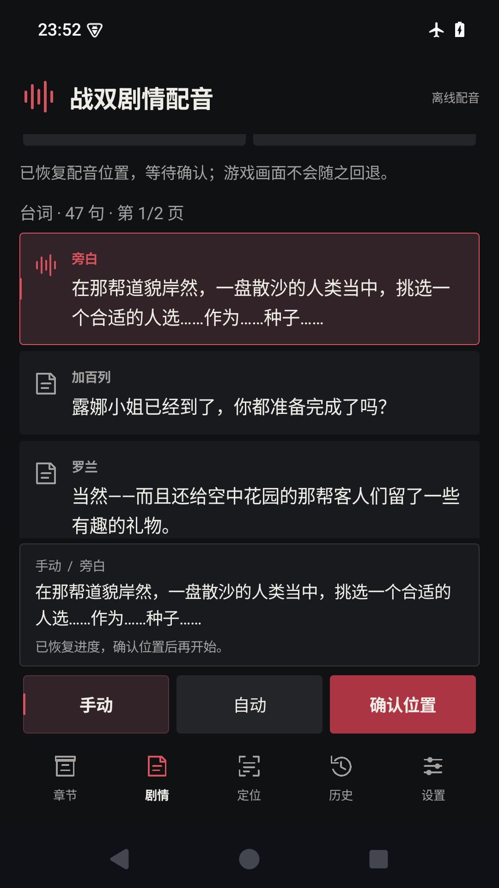
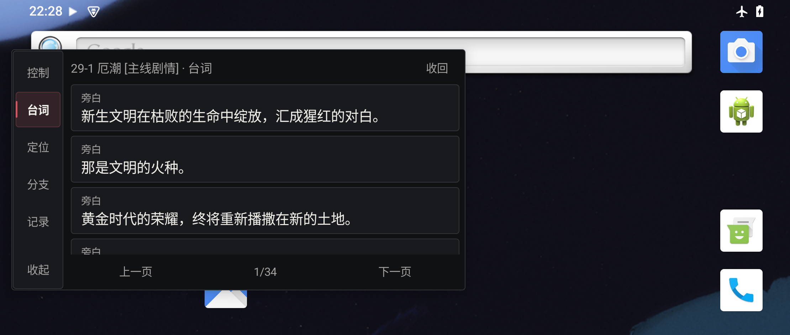
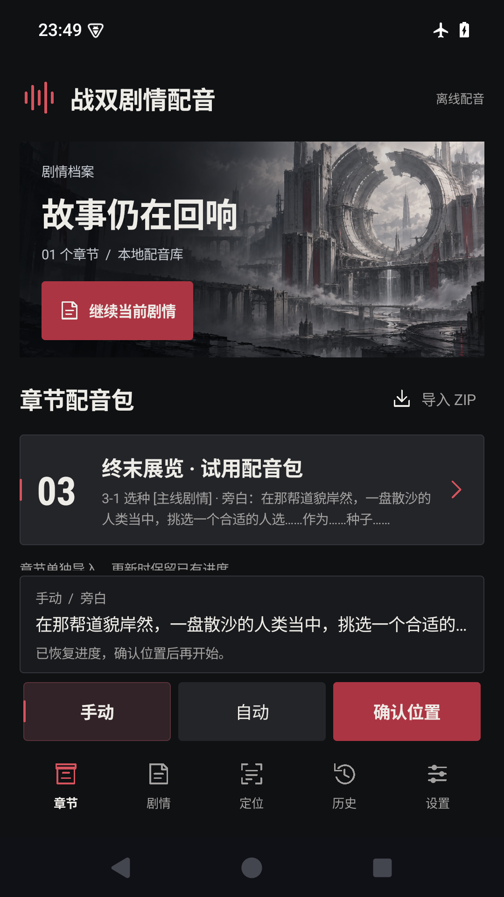
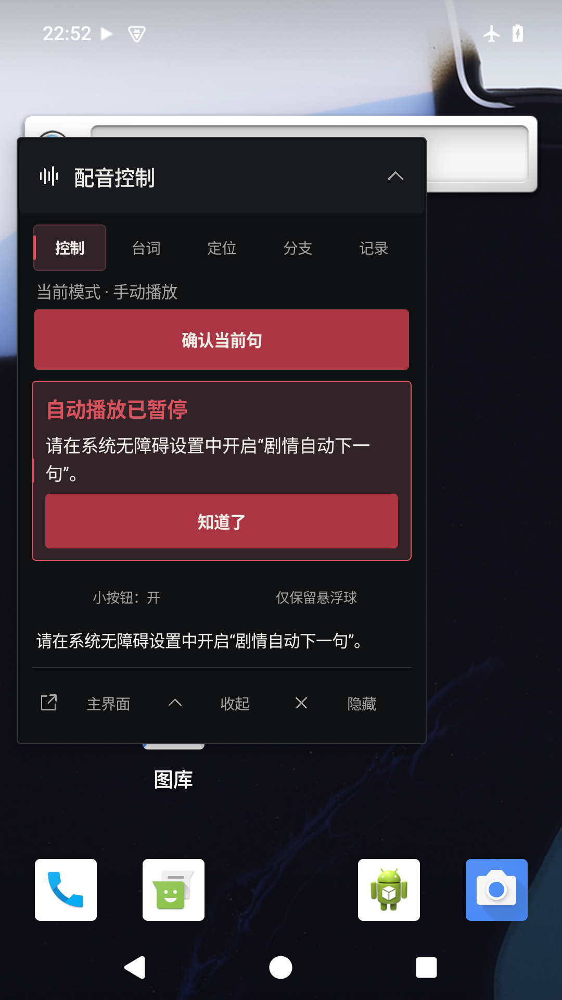
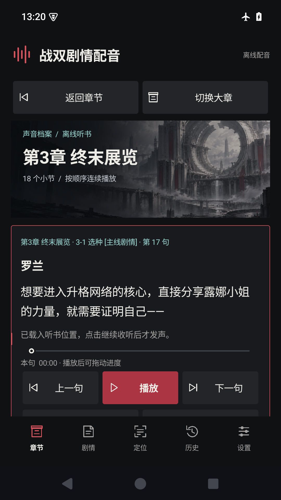

# 战双帕弥什 · 剧情配音播放器（Android 版）

非官方的**剧情配音辅助工具**，Android 原生实现。跟着游戏剧情逐句播放配音，也可以脱离游戏独立听书。

| | |
|---|---|
| **版本** | 0.3.14（versionCode 18） |
| **系统要求** | Android 10（API 29）及以上，**仅 64 位**（arm64-v8a / x86_64） |
| **包名** | `cn.pgrvoice.player` |
| **技术栈** | .NET 10 for Android（C#）、Media3 ExoPlayer、ONNX Runtime、ML Kit |

> 这是**源代码仓库**，编译产物不在这里。**APK 安装包统一在发布页下载**：
> [**pgr-voice-pack 的 Releases**](https://github.com/abc85713344/pgr-voice-pack/releases/latest) —— Windows 桌面版、Android APK 和 40 章配音包的下载说明都集中在那个仓库。

**社区讨论**：[NGA 发布帖](https://ngabbs.com/read.php?tid=47614112) ｜ [B站演示视频](https://www.bilibili.com/video/BV1FPhZ6yEZB/)

## 界面

| 剧情播放 | 台词气泡 |
|---|---|
|  |  |

| 章节与导入 | 悬浮控制 | 独立听书 |
|---|---|---|
|  |  |  |

## 功能

- **章节播放** —— 用系统文件选择器导入章节 ZIP（兼容发布包的多层目录结构），选小节和台词后逐句播放。恢复进度不会自动发声。
- **悬浮控制** —— 悬浮面板提供上一句 / 下一句 / 重播 / 暂停 / 分支 / 原声 / OCR 定位，并可手动切换跟随模式。
- **OCR 定位** —— 授予屏幕捕获权限并框选字幕区域后，按需截图识别，列出候选定位到当前台词。**PaddleOCR（模型随包，离线）** 与 **ML Kit（对照引擎）** 二选一，同一时刻只加载一个。
- **自动跟随** —— 确认当前位置后，只自动进入当前路线明确可达的下一句，要求完整文字连续两次一致；不确定、跳句、分支和未核实内容仍交给玩家确认。
- **独立听书** —— 按大章选小节连续播放，支持续听、命名书签、分支策略、句内恢复、倍速、睡眠定时和系统媒体控件。**不需要屏幕捕获，也不需要无障碍权限。**
- **可选无障碍自动播放** —— 用户自行在系统设置授权后，可在配音自然结束时点击指定的游戏下一句区域；未授权不影响普通模式。

## 构建

需要 **.NET 10 SDK（含 `android` workload）**、**JDK 21** 和 **Android SDK（API 36）**，并设置好 `ANDROID_HOME` 与 `JAVA_HOME`。

```powershell
# 模拟器包（x64，Debug）
dotnet build android/PgrVoice.Android.csproj -c Debug -r android-x64 -p:AndroidPackageFormats=apk

# 真机包（arm64，Release）
dotnet build android/PgrVoice.Android.csproj -c Release -r android-arm64 -p:AndroidPackageFormats=apk
```

发布用的 APK 需要签名，否则已安装的用户无法覆盖升级：

```powershell
apksigner sign --ks 你的密钥库.p12 --ks-key-alias 你的别名 --out 已签名.apk 未签名.apk
```

> ⚠️ **签名密钥请自行保管并备份，绝对不要提交到本仓库。** 更换密钥会导致老用户必须先卸载才能安装新版。

更详细的构建与验收说明见 [`android/README.md`](android/README.md)。

## 项目结构

```text
android/                     安卓应用工程（PgrVoice.Android.csproj）
  AppSession*.cs             主线程串行调度：章节 / 模式 / 捕获变化使旧结果失效
  MainActivity*.cs           Activity 与听书入口
  Ui/                        五个原生页面、触屏操作与字幕框选
  Platform/                  MediaProjection 前台服务、悬浮控制、Media3 音频
  Ocr/                       本地检测、裁切、识别与 ML Kit 对照
  Contracts/                 平台无关接口（音频输出 / 章节存储 / 屏幕输入）
  Diagnostics/               诊断 Activity（仅 Debug 构建导出）
  Assets/                    随包 OCR 模型、法律文本、UI 资源
  Tests/                     各模块回归工程
  docs/                      使用说明、界面设计、测试范围与验收记录
core/                        与 Windows 版共用的核心（PgrVoice.Core.csproj）
  Following/                 自动跟随的安全决策
  Listening/                 听书会话与进度
  Packages/                  章节 ZIP 的原子导入
docs/preview/                README 用的界面截图
```

**源码边界**：`core/` 复用剧情规则、ZIP 原子导入和自动跟随安全决策；平台相关内容都在 `android/Platform/`，不污染核心。

## 技术要点

- **不申请多余权限** —— 没有 `INTERNET` 或 `ACCESS_NETWORK_STATE`，不联网、无账号、无云 OCR、不需要 root。普通播放、OCR 定位和自动跟随都不依赖无障碍服务。
- **OCR 调度** —— 截图检查约 5 Hz；OCR 正常上限 2 Hz、低功耗 1 Hz。识别只允许一个任务，模型最多两个推理线程，过期结果丢弃；慢推理超过 500 ms 时自适应降频，不改用户选项。
- **区域记忆** —— 字幕区域按物理显示标识、物理像素尺寸和横竖方向分别保存，只存相对坐标，**不保存截图**。
- **音频策略** —— 「同时播放」优先保留游戏声音，不主动抢占音频焦点；「配音优先」请求短暂降低其他应用音量。两者都不修改游戏内音量。

## 已知限制

- 自动跟随需要用户先框选**实际**字幕区域。固定默认区域包含 NEXT 动画和背景，无法稳定排除换句，不能视为对所有剧情通用。
- 连续两句文字相同时请用手动「下一句」，避免把背景动画当成换句而重复播音。
- OCR 能力以有限样本验证（第 3、29 章真实截图）：Paddle 6/6、ML Kit 4/6 人工短语命中。**这是有限样本的短语检查，不是完整字准确率或普遍准确率承诺。**
- ML Kit 会把「文明」识别为「女明」，因此没有用对照结果降低自动推进的门槛。
- 性能数据来自模拟器整图识别样本（Paddle 约 247–375 ms、ML Kit 约 329–587 ms），**不能作为手机性能、持续耗电或最低配置证明**。
- 还没做真实游戏并行运行、真实手机声音混合、内外屏切换或 30 分钟持续测试。日常发热请自行判断，可手动切到低功耗或手动模式。
- 本仓库只包含应用源码。作者本机的构建 / 签名 / 真机观测脚本未包含在内（构建方式见上文）。

## 第三方组件与声明

本工具为**非官方**剧情配音辅助软件，与库洛游戏无关。

- 第三方组件清单与许可：[`android/THIRD-PARTY.md`](android/THIRD-PARTY.md)
- OCR 相关组件（PaddleOCR、ONNX Runtime、RapidOCR、ML Kit）：[`android/THIRD-PARTY-OCR.md`](android/THIRD-PARTY-OCR.md)
- 随包模型的许可文本：`android/Assets/ocr/LICENSE-*.txt`
- 依赖许可汇总：`android/Assets/legal/dependency-licenses.json`

随包的 PP-OCRv5 中文检测/识别模型来自 PaddleOCR（Apache-2.0），字典从模型元数据加载。

应用不收集、不上传任何用户数据；用户导入的章节与进度保存在应用私有目录，**卸载应用会一并删除**，需要保留的存档请先导出。

### 许可证

本项目采用[**非商业使用许可证 v1.0**](LICENSE.md)：

- ✅ 个人学习、研究、评测、直播、视频创作（**含开启平台创作激励**）
- ❌ **任何商业用途**（出售、付费服务、广告变现、捆绑销售）
- 📌 修改后分发需保留署名与同样的非商业条款

> 许可证**只覆盖作者原创的程序代码、工具与文档编排**，**不授予任何游戏内容的权利**。《战双帕弥什》的名称、角色、剧情文本、美术与音频的一切权利归库洛游戏所有。
> 完整条款见 [`LICENSE.md`](LICENSE.md)。
